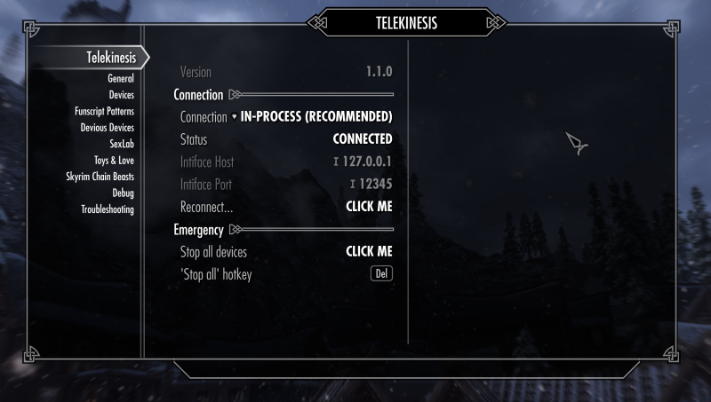

# Telekinesis (Bluetooth Toy Control for Skyrim) 1.0.0 Beta

**~ Control Bluetooth toys directly from within Skyrim ~**

I know that there was already an amazing solution with **G.I.F.T**, but sunk cost fallacy (and the prospect of TES 6 being released something like 2030) drove me to continue with my own little approach.

**Features**

- Sync real toys with events from `Devious Devices` or `Toys & Love`
- Control toys with `Sexlab` or `Toys & Love` scenes
- Re-usable API for mod authors
- Written as a native SKSE plugin for minimum Latency and to elimiate the need to setup any background processes

## Installation

1. Install `Telekinesis.7z` with a mod manager

**Depdendencies**: `SKSE64`, `Skyrim SE`, `SkyUI`, `Address Library for SKSE Plugins`
**Conflicts**: Applications that access the same bluetooth devices at the same time

## Usage

1. Connect a bluetooth toy in your operating system
2. Available toys will show up in your in-game notifications (and in MCM)
3. Open the MCM Page `Devices` and **enable** it for usage

4. There is an emergency stop hotkey (default `DEL`) in case anything goes wrong

**NOTE**: In the MCM Page `Debug` you can learn debug spells for triggering vibrations

## Caveats & Known Issues

 * Only supports vibrating devices (for now), see [list of toys that might work](https://iostindex.com/?filter0ButtplugSupport=4&filter1Connection=Bluetooth%204%20LE,Bluetooth%202&filter2Features=OutputsVibrators)
 * Only tested on Skyrim SE (v1.5.97.0) and AE (1.6.640.0)

## Manual

### General

- **Connection**: Specifies the connection method that is used to communicate with buttplug.io

    - **In-Process**: Uses an internal buttplug.io instance to control bluetooth devices. You usually want to keep it at this.
    - **Disable**: Backend is turned off entirely
    - **Intiface/WebSocket**: Use a websocket connection to connect to an intiface/buttplug.io server - *this is not supported yet and does nothing*

- **Reconnect**: Restarts the backend and uses the curreently selected connection type to reconnect. This can be helpful if a device is bugged and does not receive commands despite being connected.

### Integration

Controls integration with various mods and events. I have many ideas for making it more interactive, right now the integration is very basic.

- **Devious Devices**: Sync In-Game vibrators (the player wears) with with enabled devices. Starts vibrating on `VibrateEffectStart` and stops on `VibrateEffectStop`

- **Sexlab**: Move devices during sexlab animations. Currently this will choose a random vibration pattern until the animation ends. `Actors Orgasm` and `Actor Edge` trigger individual patterns on those events.

- **Toys & Love**:
  - **In-Game Toys** Sync in-game vibrators with enabled devices. This uses uses Toys `Pulsate` event for starting and stopping the vibration.
  - **Love Animations** Similar to sexlab animations, plays a random pattern during animation.
  - **Actor Denial** Denial events will cause vibration to stop.
  - **Actor Tease or Orgasm** Triggers a timed vibration event whenever one of those events occur.

### Devices

Lists all known devices, the connection status and their capabilities.

- **Discovery**: Enables/Disabled device scan. There is not really a reason to disable device discovery, unless you want to prevent new devices from automatically being connected. I added this for debugging purposes.

- **Enabled**: To prevent this plugin from arbitrarily moving arbitrary devices in range, you need to opt-in each device for usage. Don't worry, this selection is permanently stored and transfers between savegames.

- **Actions**: The capabilities of the device (Vibrate, Stroke, Scalar, etc.)

### Debug

- **Spells**: The player character learns a set of useful debug spells to test the device vibration, or stop vibrations. The spells will vibrate the toy at various strength (low=1, mid=10, full=100). Don't worry, these spells will disappear from the player if you unselect it.

- **Logging**: This controls which types of message are shown as an in-game notification (top left). 
  - **Devices connects**: 'Device XY has connected' etc. events are shown
  - **Device events**: 'N Device(s) have vibrated at M%' events are shown
  - **Other messages**: For debugging

## Help / FAQ

### Compatibility with G.I.F.T

This mod is compatible with G.I.F.T unless you let both apps control the very same device.

When you disable this mod (page `General -> Connection Type -> Disable`), all mod events are still logged to Papyrus.0.log, this allows you consume any vibration event send to this MOD with G.I.F.T.

### Migrating from old versions

- Uninstall `TelekinesisTest.esp` and delete it forever (it won't be needed again)
- Migrating from the early alpha versions while staying on the same save is supported, start a new game, or try to fix on your own.

### Devices don't connect

Please check that:

1. First, make sure that your device is couple correctly
2. Your device has enough battery
3. Your device is supported by buttplug.io, see [List of toys that might work](https://iostindex.com/?filter0ButtplugSupport=4&filter1Connection=Bluetooth%204%20LE,Bluetooth%202&filter2Features=OutputsVibrators)
4. Test it with [Intiface Central Desktop App](https://intiface.com/central), if a vibrator works in that app, and not in this plugin, its an issue with the mod.

### Devices don't vibrate

1. Make sure that your device is enabled in Page `Devices`
2. Make sure it has full battery (with low battery it might still be able to connect but not move)

### Bug Reports

If anything fails or behaves in an unexpected way, include the Papyrus logs `Pyprus.0.log` and the Logs of this plugin (`%USERPROFILE%/My Games/Sykrim Special Edition/SKSE/Telekinesis.lo`)
* If you can reproduce the issue, adapt the debug level by changing `Telekinesis.json` and set everything to `Trace`.

## License

This if free software. If you want to change this, redistribute it, or integrate it into your mod, you are free to whatever you like, as long as it is permitted by the [Apache License](LICENSE)

# Changelog

## 1.0.0

- Complete rework of everything
- Devious Devices Integration
- Toys & Love Integration

- Sexlab integration
- Add emergency stop hotkey

## 0.3.0

**Features**:
- Add `Tele.VibrateAllFor` to vibrate for a specific duration and then stop
- Reworked/broke entire API
    - Vibration speed is now value between 0 and 100
    - Shorter functions i.e. `Tele.VibrateAll` instead of `Tk_Telekinesis.Tk_VibrateAll`

**Fixes**:
- Now loads on AE (as intended)
- More stability/stutter fixes
    - Not a single possibly blocking call left in papyrus thread
    - Actually link against updated rust lib, so the fix from 0.2.0 is now correctly included

## 0.2.0

- Support message queuing to reduce mini lags
- More consistent naming of API functions

## 0.1.0

- Initial Version
