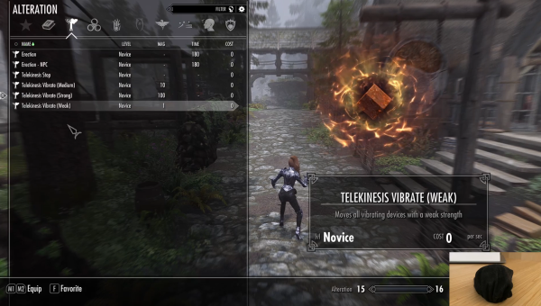
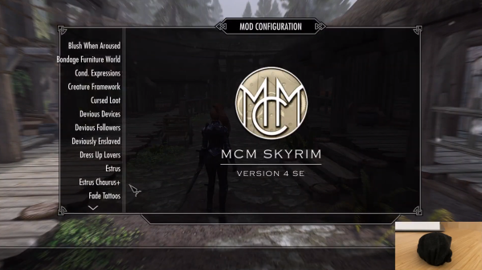

# Telekinesis (Bluetooth Toy Control for Skyrim) 1.4.1

Telekinesis is a mod that brings native support for naughty devices (bluetooth or others) to Skyrim SE, AE.

## Features

- Sync real toys with in-game toy events from `Devious Devices`, `Toys & Love` and more
- Control toys during `Sexlab` or `Toys & Love` animations
- Associate toys with certain body parts for a more immersive experience
- Written as a native SKSE plugin for minimal latency and low setup effort (works natively, no background processes required)
- Re-usable API for mod authors

Watch the demo video:

## 1. Installation

1. Install `Telekinesis.7z` with a mod manager
2. Install dependencies `SKSE64`, `SkyUI`, `Address Library for SKSE Plugins`
3. Install optional dependencies `Sexlab`, `Sexlab Arousal`, `Toys & Love`, `Ostim Standalone`

**Conflicts**: Applications that access the same bluetooth devices at the same time

## 2. Quickstart

1. Connect a bluetooth toy in your operating system
2. Once connected, toys will show up in your in-game notifications (and in the MCM device page)
3. Open the MCM Page `Devices` and **enable** the connected device for usage (See [Manual: 2. Device Setup](./doc/1-Setup.md#Device_Setup))
4. Configure the emergency stop hotkey (default `DEL`)
5. Open the MCM and enable functionalities of your choice

**Video guide**

## 3. Manual

Please follow the detailed manual to get everything started:

1. [System & Device Setup](./doc/1-Setup.md)
2. [Setup Virtual Sex](./doc/2-VirtualSex.md)
3. [Setup Virtual Toys](./doc/3-VirtualToys.md)
4. [Set up Body Parts](./doc/4-SetUpBodyParts.md)
5. [Funscripts](./doc/5-Funscripts.md)
5. [Bug Reports](./doc/6-Debugging.md)

## 4. FAQ

### Limitations & Support

**Working Game Versions**
 *    Skyrim SE (v1.5.97.0)
 *    Skyrim AE (1.6.640.0) and (1.6.1130.0), all AE versions should work.
   
**Limited Support**
 * Skyrim VR (Certain MCM Inputs seem broken, try **Telekinesis.json** for configuring devices as a workaround)

**Unsupported**
 * Skyrim LE

I do not own Skyrim VR or Skyrim LE and won't be able to test it.

**Limitations**
 * Only works with vibrators and linear strokers for now. Other actuator types like oscillators, constrictors, inflators, rotators are to be done
 * Only supports devices that are supported by buttplug io, [List of toys that might work](https://iostindex.com/?filter0ButtplugSupport=4&filter1Connection=Bluetooth%204%20LE,Bluetooth%202&filter2Features=OutputsVibrators)

**Known Issues**

* Ostim Versions that are older than Ostim Standalon seem to not work.
* It is not possible to use two different linear devices (Strokers) with differing min and max values at the same time. Doing so will result in device buggy movement. 
* There are reports that the MCM Page seems to not load for certain users. If you encounter these Issues, please contact me via LL or Github and include as much information as possible, as I'm trying to solve this issue.

### Migrating from old versions

- Migration from all versions after 1.0.0 should be possible without starting a new save
- If you encounter issues, please report them to me
- Your device-specific or MCM settings might be dropped on upgrade

### What do if devices don't connect?

Assure that:

1. Your device is coupled correctly (bluetooth settings)
2. Your device has enough battery
3. Your device is supported by buttplug.io, see [List of toys that might work](https://iostindex.com/?filter0ButtplugSupport=4&filter1Connection=Bluetooth%204%20LE,Bluetooth%202&filter2Features=OutputsVibrators)
4. Test it with [Intiface Central Desktop App](https://intiface.com/central), if a vibrator works in that app, and not in this plugin, its an issue with the mod.
5. The device is Bluetooth. 

**NOTE:**

Telekinesis In-Process connection comes with a pre-packaged version of buttplug-io, that may be older than the version used by Intiface-Central, and may have less device support than Intiface-Central. In that case, you can use Intiface Central via WebScoket connection as a backend to use **any** device supported by Intiface Central.

Devices that use serial port, lovesense connect, or other exotic connection mechanisms can work with Intiface App if your enable those connection methods (Server Settings) and select Intiface-Webapp as the connection method in Telekinesis MCM.

### Devices don't vibrate

1. Make sure that your device is enabled in Page `Devices`
2. Make sure it has full battery (with low battery it might still be able to connect but not move)

### Bug Reports

If anything fails or behaves in an unexpected way, include the Papyrus logs `Pyprus.0.log` and the Logs of this plugin (`%USERPROFILE%/My Games/Sykrim Special Edition/SKSE/Telekinesis.log`)
* If you can reproduce the issue, adapt the debug level by changing `Telekinesis.json` and set everything to `Trace`.

## License

This mod is free software and can be used under the terms of the [Apache License V2](LICENSE) 

## Changelog

## 1.4.1

### Features

- Add option to disable red error notifications (Page "Debug")

### Bugfixes

- Fix systems with unicode characters in skyrim path (previous version will crash on load due to encoding issues)

## 1.4.0

### Features

- Support Milk Mod Economy (thanks to PR by Sylphia Nox)
- Active connections are now marked green
- Display battery level (if supported)

### Bug Fixes

- Fix connection errors being attached to the wrong actuator
- Reduce binary size greatly

[Older Entries...](CHANGELOG.md)
