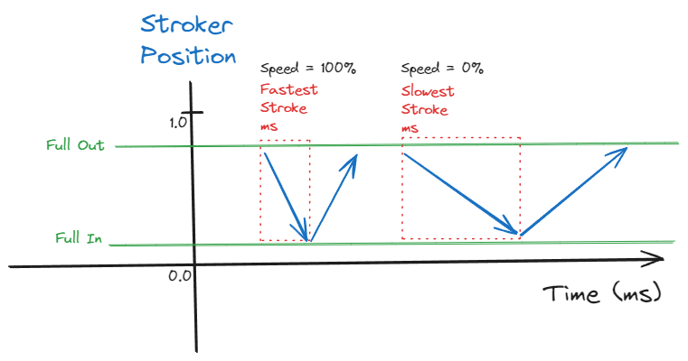

# System & Device Setup

This is an overview of various Mod settings available through the MCM

## 1. Connection

On the first start, open the Telekinesis MCM to check if Connection Status is `Connected`.

If it works, there is no reason to change any of the settings. You should leave it on `In-Process`, unless you have a very specific reason to use something else.

- **Connection** `[1]`: This specifies the connection method that is used to communicate with buttplug.io
    - **In-Process**: The built-in DLL does everything (recommended)
    - **Intiface (WebSocket)**: Redirects the vibrator control to a running instance of the Intiface App. This means that you always have to run Intiface in the background and specify its `Intiface Host` and `Intiface Port`. This setting is only useful if you want to run the server with custom backend (like Serial Ports), which are disabled in the In-Process   
    - **Disable**: Vibrator control is disabled entirely (use this if want to use Telekinesis features with a 3rd party log parser)

Note: Whenever you change any of the settings it is important to `Reconnect` `[2]`, otherwise it will have no effect

## 2. Devices

Device discovery is active by default. This means that any bluetooth-based device will be discovered automatically once the mod is loaded.

Every time a device connects or disconnects, a Notification in the top left will indicate this to you:

### Step 1: Enable Devices

Whenever a new device is discovered for the first time, it has to be activated manually for usage. This is a safety measure to prevent this mod from arbitrarily moving connected bluetooth devices, simply because they are within range. 

This must be done individually for every device and is remembered independendly of your savegame (setting are stored in `SKSE/Data/Telekinesis.json`)

### Step 2: Fine-Tuning Devices

Since `v1.3.0` you can customize the strength and behavior on a device-basis, to customize how these things are used according to your liking. Especially for strokers, this is highly recommended before playing, to assure that you don't hurt yourself!

These settings are global and will be applied to every single interaction with that device. Depending on the physical form of the device, different settings will be available.

##### Scalar Devices (Vibrators, Oscillators, etc):

- **Min/Max Speed** `[]`: Limits the lowest and highest possible strength for any scalar device. This excludes setting Speed to 0, which means Stop and is always possible.
- **Downscale Factor** `[]`: This is a factor applied to the strength. A downscale factor of `0.5` will turn a Speed of 100% that is sent to this device to 50%.

##### Position Devices (a.k.a Linear Devices, Strokers)

- **Fastest Stroke** `[]`: The time in milli-seconds the device will take when moving from position `0.0` to `1.0` at 100% Speed
- **Slowest Stroke** `[]`: The time in milli-seconds the device will take when moving from position `0.0` to `1.0` at 0% Speed
- **Full-In / Full-Out** `[]`: This is a floating point value betwen `0.0` to `1.0` that indicates the minimum or maximum phyiscal position of the device that is considered a full penetration. Please note that in Funscripts, the `0.0` Position is considered a full penetration. If that is not the case for your device, you can use **Invert** `[]` to revert this logic.

**Warning**: Please note that stroker funscripts will currently ignore all device settings to make sure that funscripts are always played in the intended speed, so please make sure that you play only sensible funscripts, that don't do crazy stuff, and won't break your device (or your body)

### Step 2: Correspond Body Parts (Optional)

**Body Parts** `[3]` contains comma seperated list of body-parts that are associated with each device.

This setting has no effect on its own, but can be used by certain mod features to filter for devices (an example being the devious devices integration).

