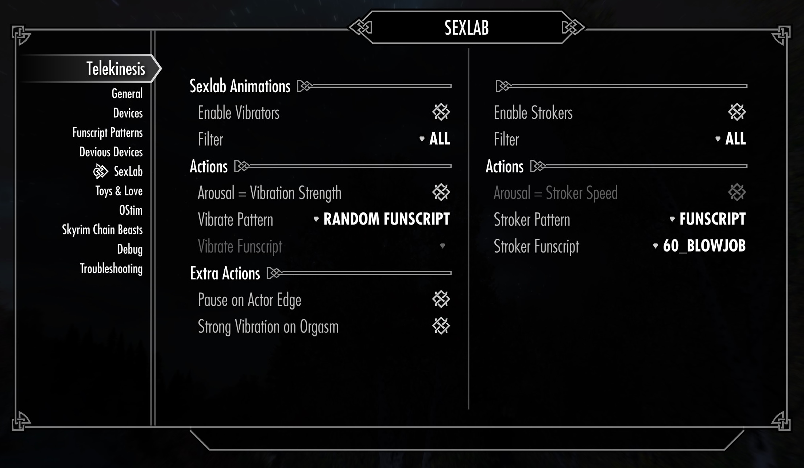
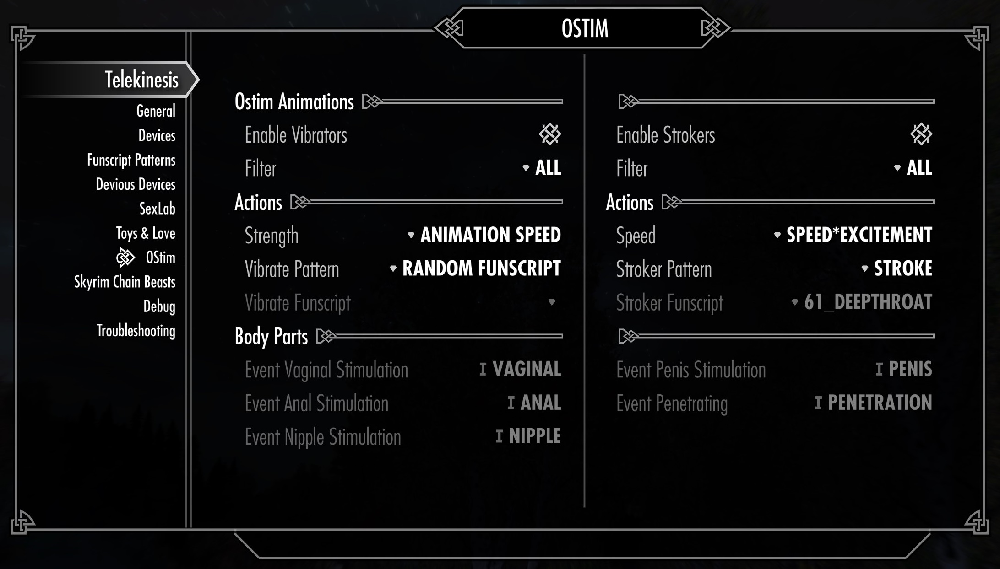
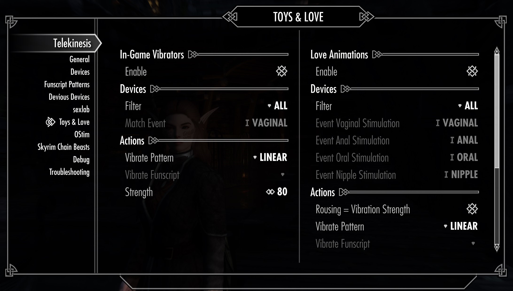
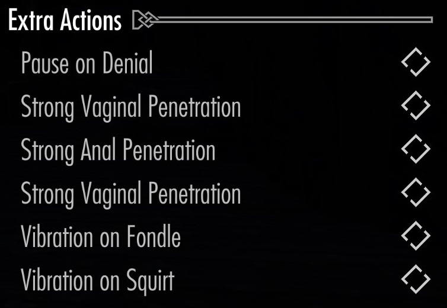

# Virtual Sex

Unless you enable actual features, Telekinesis will do nothing.

In general, any feature will give you the following options to contro when and how to move your connected devices:

- **Enable** enables or disables a feature alltogether
- **Filter** controls *which* devices are selected for movement
- **Actions** controls *how* the devices are used (strength, movement pattern, etc.)

## 1. Love Scene Integration

Telekinesis can integrate with `Ostim Standalone`, `Sexlab` and `Toys & Love` to move your devices whener your player character is involved in a sex scene.

If Vibrators or Strokers are enabled, Telekinesis will move those devices for any sexual animation involving the player. In `Sexlab` or `Love` (as of Telekinesis 1.3.0) this is basically on any animation involving the player, while on `Ostim` this is any scene that has the `sexual` flag.

Note: Currently `v1.3.0` only `Ostim Standalone` and `Sexlab` support strokers, because I forgot about `Toys&Love`

### Device Selector

By default, **Filter=ALL** `[]` will simply start ANY available device. If option `Match Body Parts` is explained in SETUP BODYPARTS

### Actions

When a device is controlled, it executes a certain **Action** with a specific **Speed**. **Speed** is any value between **0%** and **100%** and may either be derived from a settings or other in-game information (like animation speed, player rousing or a constant user-defined value). 

How this value is derived depends on the specific action and its settings. Some actions, like Funscripts played on `Linear` devices, may choose to ignore the **Speed** in case it cannot be applied.

#### Linear (Vibrators)

Moves the device with a constant Speed (scalar devices like vibrators only)

#### Stroke (Strokers)

A constant stroking movement. Speed is used as a factor when calculation the duration of the in-and-out-movements between the minimum and maximum stroke length for each specific device. 

The range and speed of the stroking movement depends on the current dynamically determined **Speed** and on the configured limit for the Stroker device. See [Section 1: Setup](1-Setup.md#2-devices) for more details on how to configure your stroker.

#### Funscripts (Vibrators & Strokers)

Plays an available funscript file. You can either select a specific funscript or choose a new random funscripts on every action.

- For vibrators, if you select dynamic speed controll, the current **Speed** will have an effect on the maximum strength of the funscript pattern.
- For stroker, any external **Speed** and device settings are ignored (for now), and all funscripts are played as specified by the file.

See [Section 5: Funscripts](5-Funscripts.md) for detailed information on using and creating custom funscripts.

#### Dynamic Speed Control

Some actions support dynamic speed control based on various in-game information. This behavior is heavily dependent on the mod you use to play a love scene:

- `SexLab`: If you run `Sexlab Aroused`, you may enable **Arousal = Vibration**. This means that the strength of the device is coupled to the players current rousing (0 = 0% Speed, 100 = 100% Speed)
- `Toys & Love`: Player rousing can be used to control the love scene. Works like `Sexlab Arousad` (0 Rousing = 0% Speed, 100 = 100% Speed)
- `Ostim Standalone`: You can couple animation Speed (controlled by `-` / `+`) and/or player rousing to control the device **Speed**.

#### Extra Events

Some sex frameworks may offer specific events, that can be used to overlay other actions. Extra Actions may overwrite other stop other actions for a certain amonut of time.

##### Toys & Love

- `Denial` will stop all device movement for a certain amount of time.
- `Strong X Penetration` will catch `Penetration` events and vibrate devices associated with `Anal`, `Vaginal` body parts strongly.
- `Squirt` or `Fondle` are events that can occur within or outsides of sex scenes and will cause a constant vibration for `X` amount of seconds.

<!--   -->

