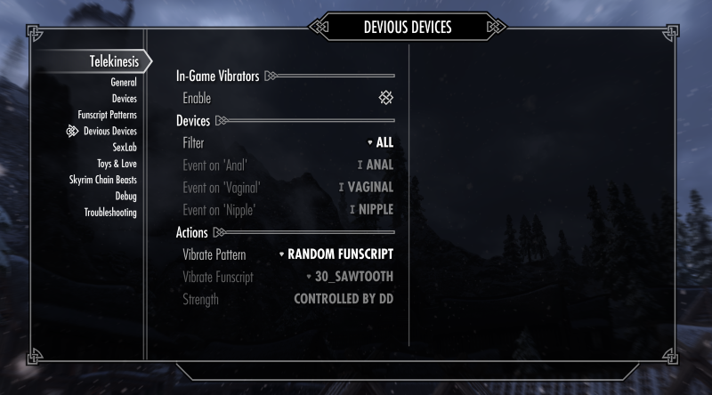
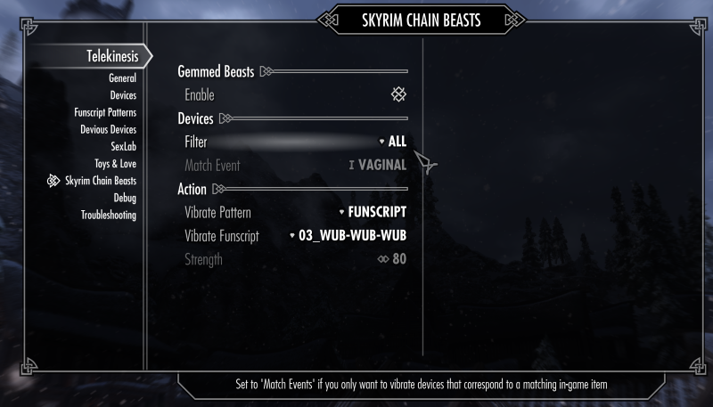

# Virtual Toys

### 3.1 Devious Devices

The Devious Devices Integration syncs IRL devices with vibration events on player-worn vibrators. If the setting is enabled, vibrators will start  on `VibrateEffectStart` and stop on each `VibrateEffectStop` event that is fired on the player character.

### Actions

The action menu is similar to Vibrator integration for Virtual Sex (see previous chapter).

The **Speed** of the vibration is determined by the in-game strength value of the vibration. This is indicated by the flavor tag and goes from `1 very weak` (20%) to `5 very strong` (100%).

#### Filter: All 

Will use all devices that have the capability to vibrate (Default)

#### Filter: Match Body Parts

Will check worn devices and only vibrate events that are associated with specific body parts (`Anal`,`Vaginal`, `...`)

Please note that these events only check which devices are currently  **being worn**, and will not make a distinction based on the flavor tags that show up in the notification tray. 

So if th player wears a **Nipple Piercing** and a **Vaginal Plug**, the vibration event will **always** trigger for **Vaginal** and **Nipple**, because that is what the `VibrateEffectStart` event claims, independendly of the content of the flavor tag.

### 3.2 Unforgiving Devices

`Unforgiving Devices` emits the same events as `Devious Devices`, so integration will **somewhat** work. However, because Telekinesis does not support long-running vibrations that last over various save-load-cycles, long running or infinitely vibrating vibrators will break at some point.

Also, any extra information only available in `Unforgiving Devices` is also ignored.

### 3.4 Skyrim Chain Beasts

A very experimental integration that will not work unless you recompile SCB_VibeEffect.psc (version 0.7.0).

### Example: Setting up body specific vibrators
