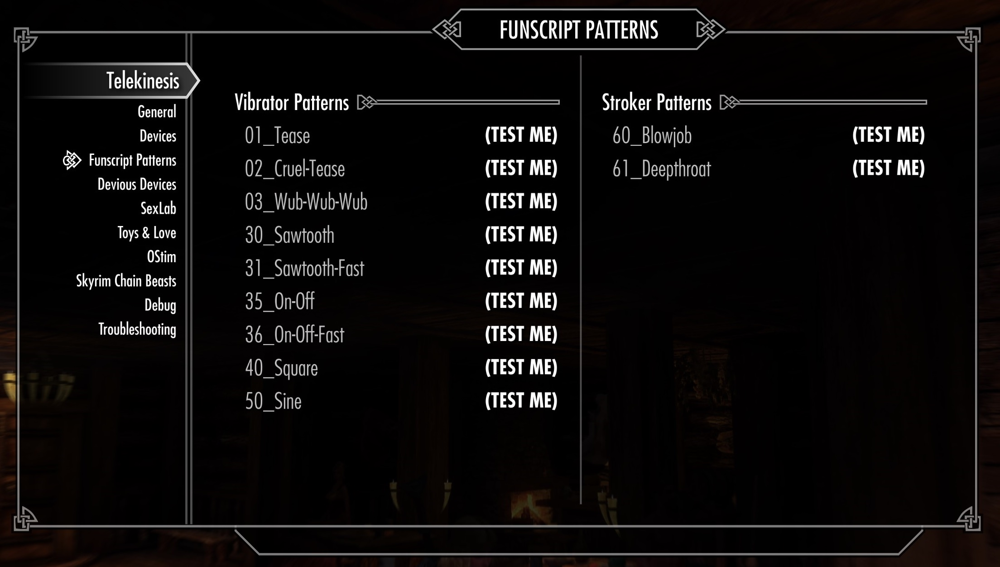

# Use and create Funscripts

Funscript is a file format to control bluetooth strokers and vibrators.

Naturally, these two devices types differ and so stroker funscripts will not be compatible to 

- Regular funscript files `.funscript` are for linear movement devices (strokers, fucking machines), basically anything that moves between two positions
- Vibrator funscript files `.vibrator.funscript` are for scalar devices (vibrators)

- The `Funscript Patterns` page shows all patterns that are available in `Skyrim Special Edition\Data\SKSE\Plugins\Telekinesis\Patterns\*.funscript`

## Customize Funscripts

Funscript is an open json-based format for storing stroker or vibration patterns.

You can add any funscript to telekinesis and use it in game. 

1. Use any tool like [OpenFunscripter](https://github.com/OpenFunscripter/OFS) or a text editor to generate a new funscript file
2. Add your file to `Skyrim Special Edition\Data\SKSE\Plugins\Telekinesis\Patterns\*.funscript`
3. If your file is for vibrators, make sure to use the file ending `vibrator.funscript`
4. Open Telekinesis, and it should show up in the funscript page and be usable.
5. You may package your custom funscripts as a mod to be installed with `Vortex` or `MO2`, by creating a custom zip file that mirrors the `SKSE\Plugins\Telekinesis\Patterns\*.funscript` structure (see Telekinesis.7z)

Note: All funscripts in the MCM and Selection List are ordered by file name, so you should use a leading number `91_YourFile.funscript` to put your funscripts in your intended order. 