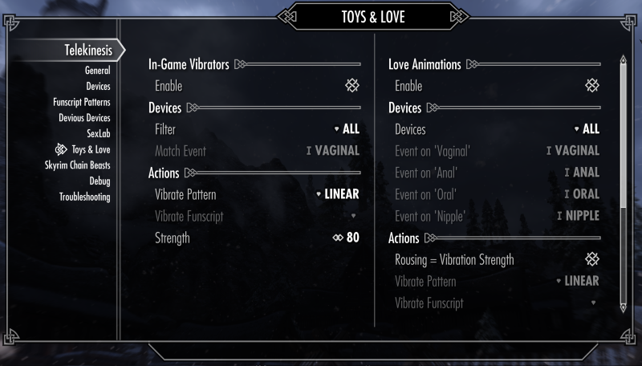

# User Manual

This is an overview of various Mod settings available through the MCM

## 1. Connection Settings

The entry page gives you an overview of the connection status. There is no reason to change any of the settings. You should leave it on `In-Process`, unless you have a very specific reason to use something else.

- **Connection**: This specifies the connection method that is used to communicate with buttplug.io
    - **In-Process**: The built-in DLL does everything (recommended)
    - **Intiface (WebSocket)**: Redirects the vibrator control to a running instance of the Intiface App. This means that you always have to run Intiface in the background and specify its `Intiface Host` and `Intiface Port`. This setting is only useful if you want to run the server with custom backend (like Serial Ports), which are disabled in the In-Process   
    - **Disable**: Vibrator control is disabled entirely (use this if want to use Telekinesis features with a 3rd party log parser)

Whenever you change any of the settings it is important to `Reconnect`, otherwise it will have no effect

## 2. Device Setup

Device Discovery is active by default. This means that any bluetooth-based device will be discovered automatically when the mod is loaded.

### Step 1: Enable Devices

Whenever a new device is discovered for the first time, it has to be activated manually for usage. This is a safety measure to prevent this mod from arbitrarily moving connected bluetooth devices simply because they are within range. This step has to be done only once for every device and will remembered independendly of your savegame (setting stored in `SKSE/Data/Telekinesis.json`)

### Step 2: Correspond Body Parts (Optional)

**Events** contains comma seperated list of body-parts that are associated with each device.

This setting has no effect on its own, but can be used by certain mod features to filter for devices (an example being the devious devices integration)

## 3. Features & Mod Integration

Telekinesis interacts with various different mods. The settings for most features are separated in three sections

- **Enable** enables or disables the feature alltogether
- **Devices** controls *which* devices are used
- **Actions** controls *how* the devices are used (strength, movement pattern, etc.)

### 3.1 Devious Devices

The Devious Devices Integration syncs IRL devices with vibration events on player-worn vibrators. If the setting is enabled,
vibrators will start  on `VibrateEffectStart` and stop on each `VibrateEffectStop` event that is fired on the player character.

#### Device Filters

This sections is used to select which devices to vibrate. 

- **All** Will use all devices that have the capability to vibrate (Default)
- **Match Events** will select devices based on device events/tags (`Anal`,`Vaginal`, `...`)

In case of devious devices, match events will correlate to the devices worn by the player. Because only vibrations make sense in this context, only vibrators can be selected.

**Example: Setting up body specific vibrators**

Lets assume a `VibrateEffectStart` occurs on the player character, based on the following settings, these scnarios can happen:

- In the first case `All` filter was selected. This will select all devices that can vibrate, even if they have no tags associated.
- In the second case the in-game character wears a vibrating nipple piercing and one Vibrator is tagged with `Nipple`
- In the third case the in-game charecter wears a vibrating anal plug and a vibrating nipple piercing, this will result in both devices being vibrated.

| **Device Filter**   | In-Game Devices       |       IRL Plug (Events=Anal,Vaginal) | IRL Nipple Vibrator (Events=Nipple) | IRL Device 3 (Events="")     |
|-------------------------|---------------------  |--------------------------------------|----------------------              |--------------------------------|
| All          |             *                    | Vibrates                             | Vibrates                           |         Vibrates
| Match Events | Vibrating Plug                   | Vibrates                             |       -                            |           -
| Match Events | Vibrating Plug, Nipple Piercing  | Vibrates                             | Vibrates                           |           -

#### Actions

The option **Vibrate Pattern** controls how those selected devices are utiziled:

- **Linear**: A regular vibration with a constant strenght. The strength may by determined by various factors, for devious devices the in-game vibration strength (1 very weak - 5 very strong) is used.
- **Funscript**: Plays a specific funscript (select in **Vibrate Funscript**)
- **Random Funscript**: Uses a randomly selected funscript

### 3.2 Sexlab

Move devices during sexlab animations that involve the player character

- Supports `Sexlab Aroused` if you enable **Arousal = Vibration**. This means that the strength of the device is coupled to the players current rousing (0 = 0%, 100 = 100% vibration strength)
- **Match Events** will use the tags of the Sexlab Animation to match devices
- Currently only supports vibrators (strokers might come at some point on the future)

### 3.3. Toys & Love

Offers the Sexlab and DD functionality but just for **Toys & Love**. Also offers additional actions for **Toys & Love** specific events like **Fondling**, **Denial** or **Penetration**.

Extra Actions will overlay other vibration patterns, so when you select `Pause on Denial`, it will stop all other devices for a few seconds, until the other movements continue.

 

### 3.4 Skyrim Chain Beasts

A very experimental integration that will not work unless you recompile SCB_VibeEffect.psc (version 0.7.0).

## 4. Patterns

Funscript is a file format to control bluetooth strokers and vibrators.

- All patterns are stored in `Skyrim Special Edition\Data\SKSE\Plugins\Telekinesis\Patterns\*.funscript`
    - Yes, you can add your own if you want.
- Regular funscript files `.funscript` are for linear movement devices (strokers, fucking machines), basically anything that moves between two positions
- Vibrator funscript files `.vibrator.funscript` are for scalar devices (vibrators)
- The device endings `.vibrator.funscript` or just `.funscript` will control the specific type of pattern.

## 5. Debugging Utilities

Varius tools and Settings for debugging issues or just toying around...

- **Spells**: The player character learns a set of useful debug spells to test the device vibration, or stop vibrations. The spells will vibrate the toy at various strength (low=1, mid=10, full=100). Don't worry, these spells will disappear from the player if you unselect it.

- **Logging**: This controls which types of message are shown as an in-game notification (top left). 
  - **Devices connects**: 'Device XY has connected' etc. events are shown
  - **Device events**: 'N Device(s) have vibrated at M%' events are shown
  - **Other messages**: For debugging

## 6. Advanced Topics

tbd

