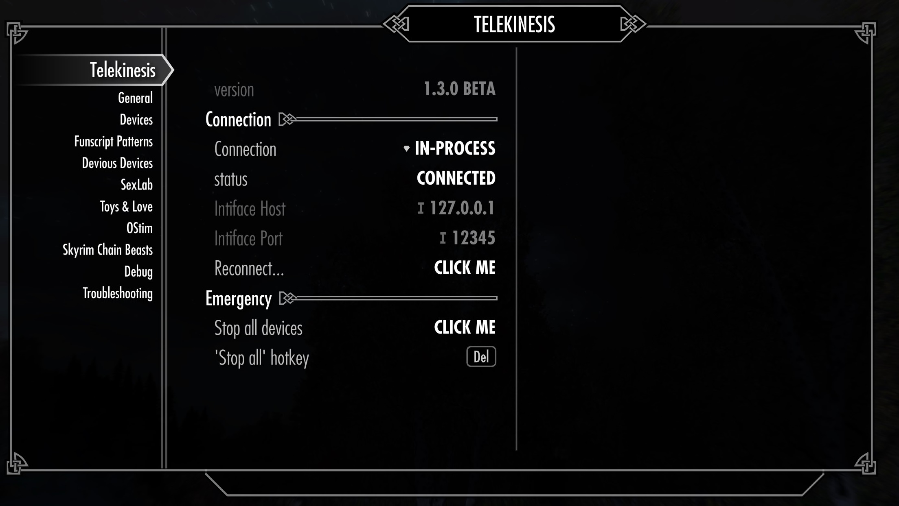
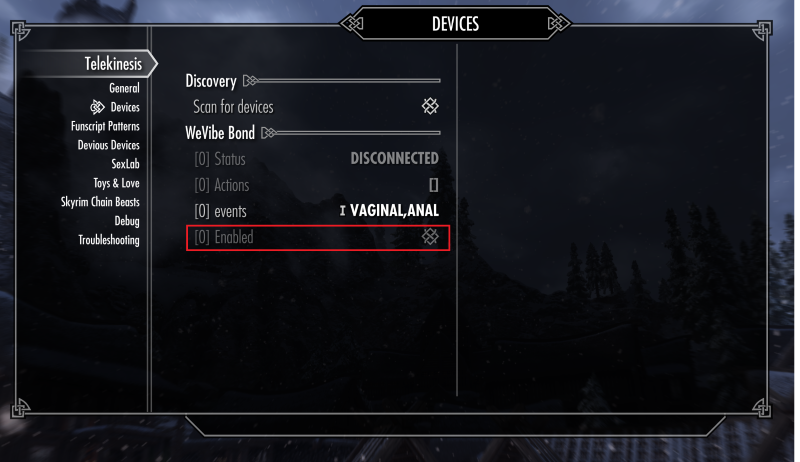
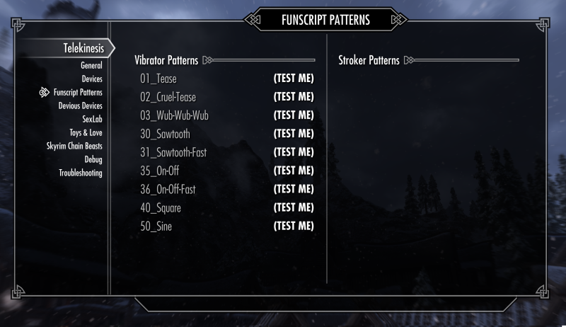
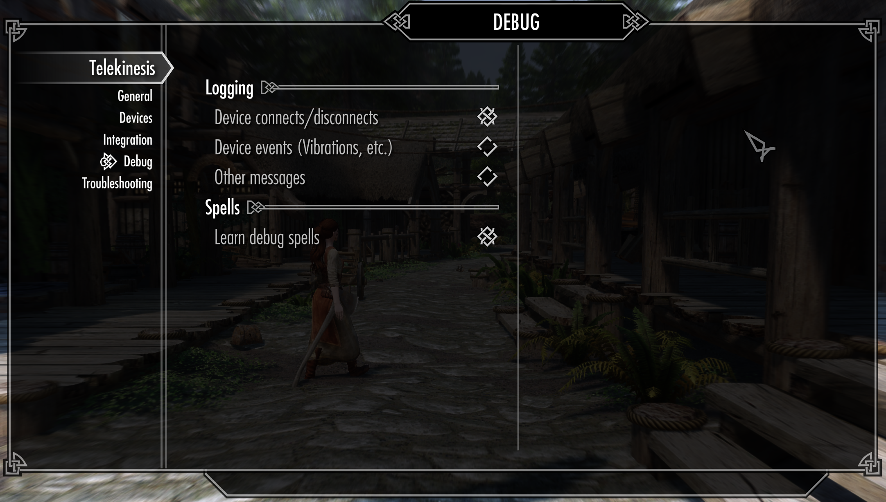
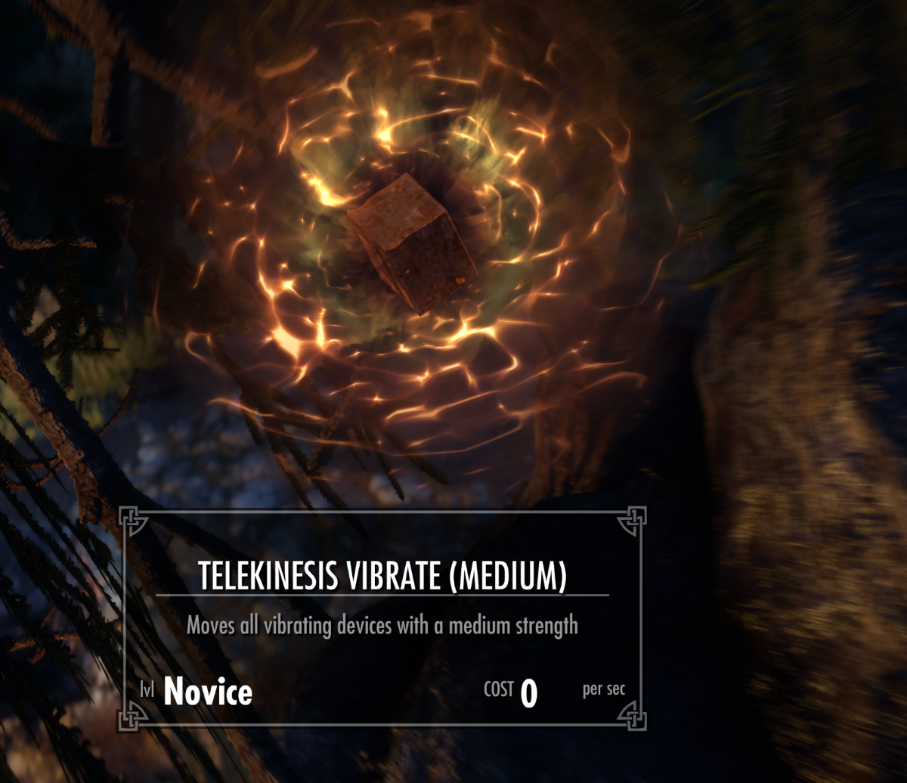

# User Manual

This is an overview of various Mod settings available through the MCM

## 1. Connection Settings

The entry page gives you an overview of the connection status. There is no reason to change any of the settings. You should leave it on `In-Process`, unless you have a very specific reason to use something else.

- **Connection**: This specifies the connection method that is used to communicate with buttplug.io
    - **In-Process**: The built-in DLL does everything (recommended)
    - **Intiface (WebSocket)**: Redirects the vibrator control to a running instance of the Intiface App. This means that you always have to run Intiface in the background and specify its `Intiface Host` and `Intiface Port`. This setting is only useful if you want to run the server with custom backend (like Serial Ports), which are disabled in the In-Process   
    - **Disable**: Vibrator control is disabled entirely (use this if want to use Telekinesis features with a 3rd party log parser)

Whenever you change any of the settings it is important to `Reconnect`, otherwise it will have no effect

## 2. Device Setup

Device Discovery is active by default. This means that any bluetooth-based device will be discovered automatically when the mod is loaded.

### Step 1: Enable Devices

Whenever a new device is discovered for the first time, it has to be activated manually for usage. This is a safety measure to prevent this mod from arbitrarily moving connected bluetooth devices simply because they are within range. This step has to be done only once for every device and will remembered independendly of your savegame (setting stored in `SKSE/Data/Telekinesis.json`)

### Step 2: Correspond Body Parts (Optional)

**Events** contains comma seperated list of body-parts that are associated with each device.

This setting has no effect on its own, but can be used by certain mod features to filter for devices (an example being the devious devices integration)

### Step 3: Correspond Body Parts (Optional)

## 4. Patterns

Funscript is a file format to control bluetooth strokers and vibrators.

- All patterns are stored in `Skyrim Special Edition\Data\SKSE\Plugins\Telekinesis\Patterns\*.funscript`
    - Yes, you can add your own if you want.
- Regular funscript files `.funscript` are for linear movement devices (strokers, fucking machines), basically anything that moves between two positions
- Vibrator funscript files `.vibrator.funscript` are for scalar devices (vibrators)
- The device endings `.vibrator.funscript` or just `.funscript` will control the specific type of pattern.

## 5. Debugging Utilities

Varius tools and Settings for debugging issues or just toying around...

- **Spells**: The player character learns a set of useful debug spells to test the device vibration, or stop vibrations. The spells will vibrate the toy at various strength (low=1, mid=10, full=100). Don't worry, these spells will disappear from the player if you unselect it.

- **Logging**: This controls which types of message are shown as an in-game notification (top left). 
  - **Devices connects**: 'Device XY has connected' etc. events are shown
  - **Device events**: 'N Device(s) have vibrated at M%' events are shown
  - **Other messages**: For debugging

## 6. Advanced Topics

tbd

